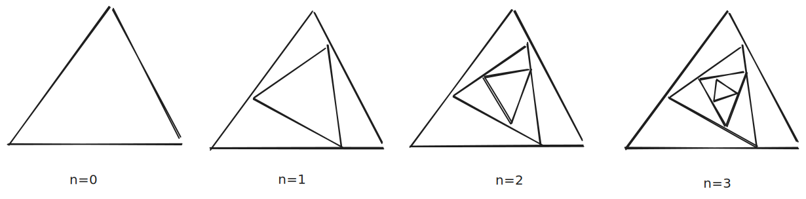

# Recursion Example with raylib

This is an example of recursive drawing with raylib.

The program draws a series of nested triangles using recursion. The drawing below illustrates the progression of drawing for each level of recursion (specified by `n`).

Each nested triangle is rotated slightly such that its corners are shifted one-third the distance along the parent triangle's edge.

